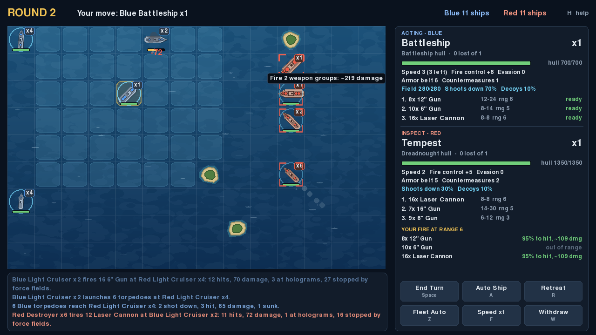
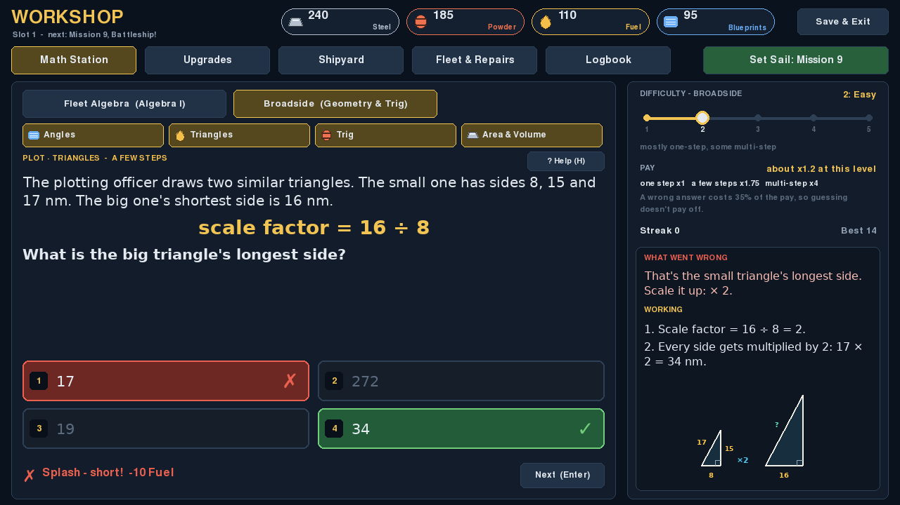
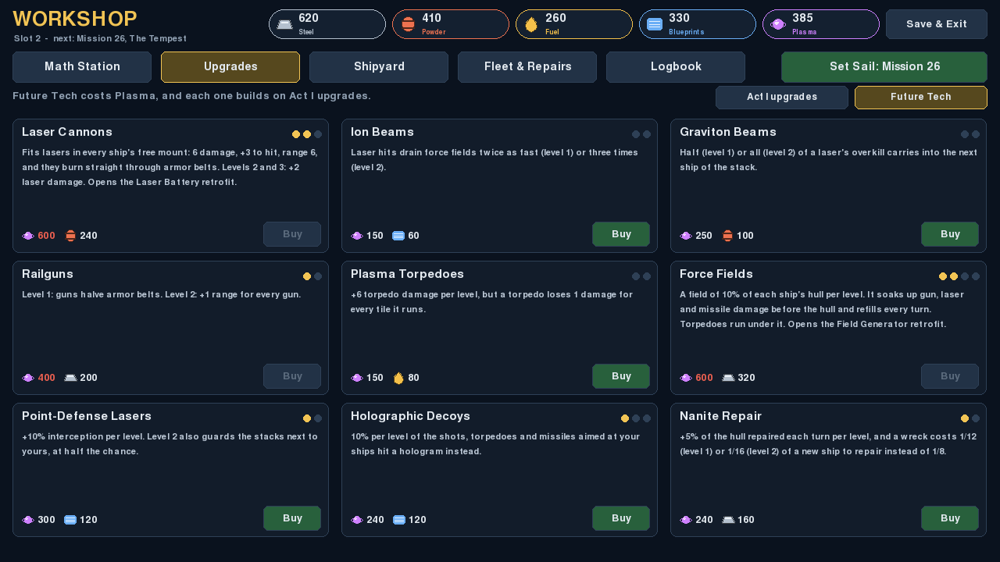
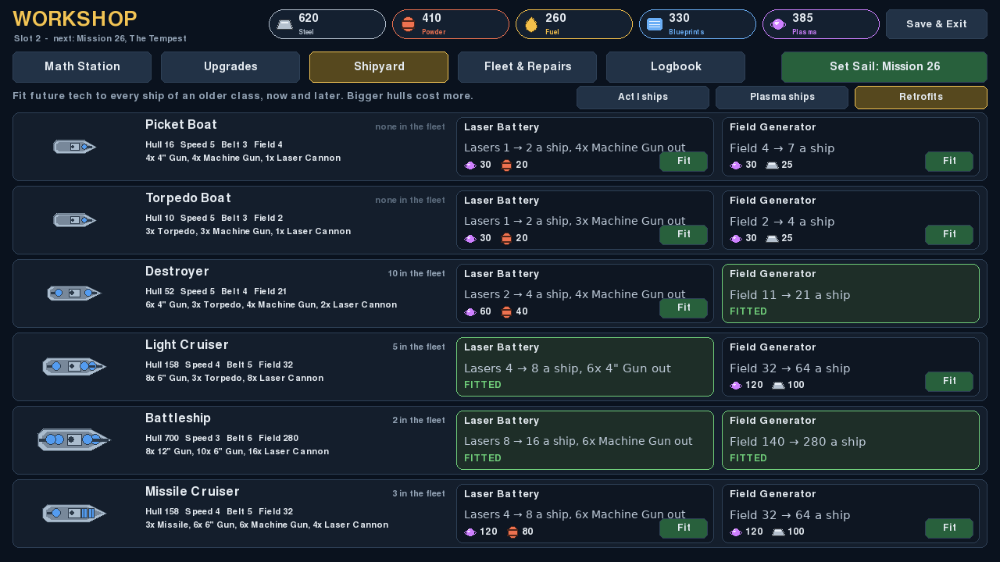
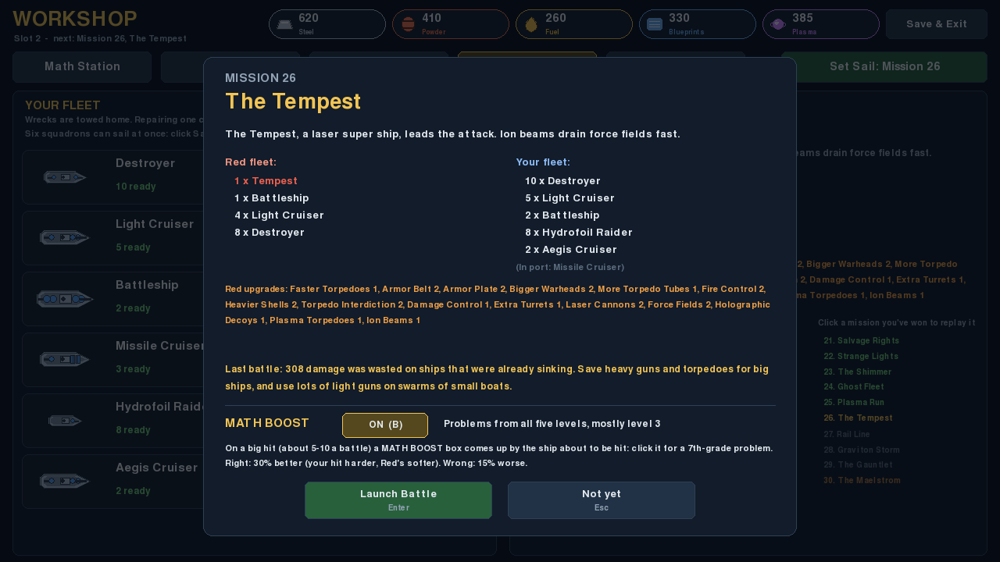
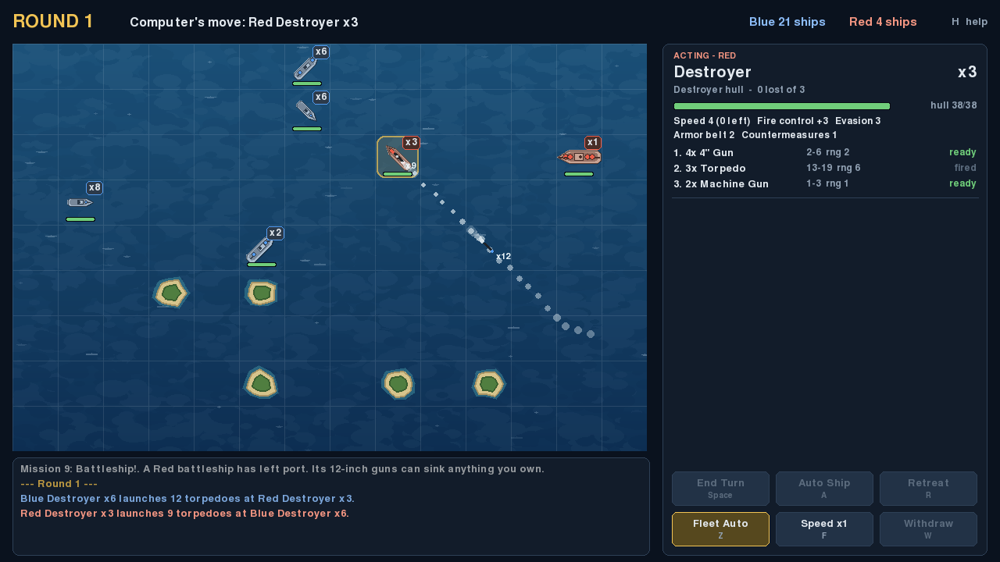
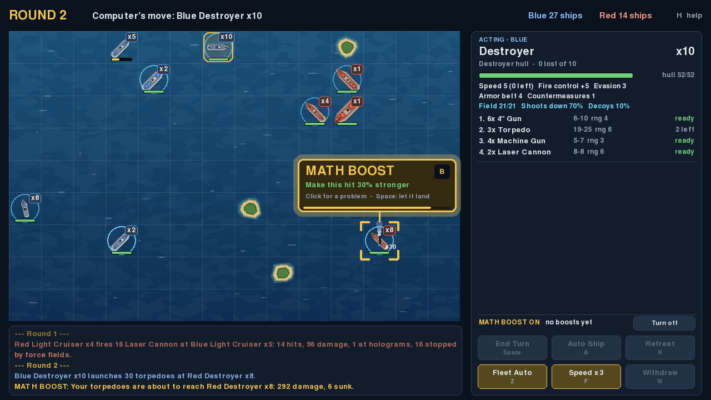
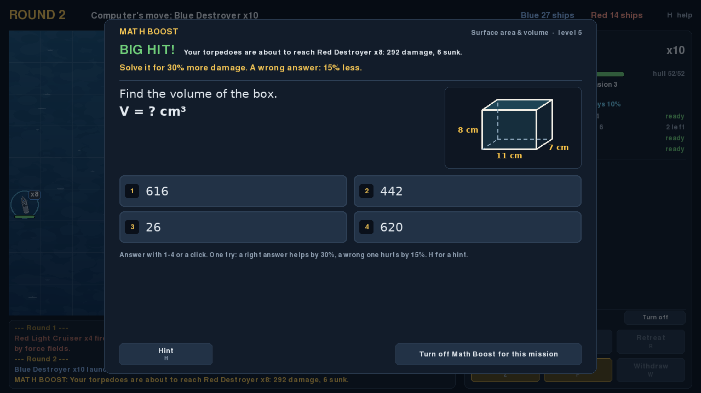
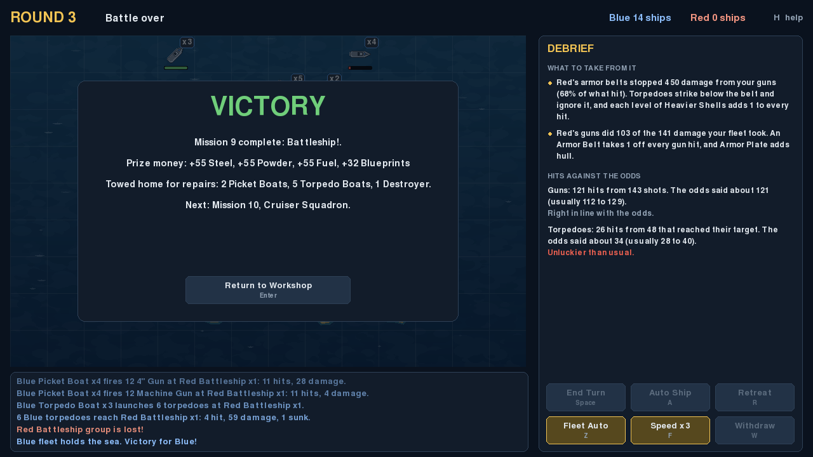
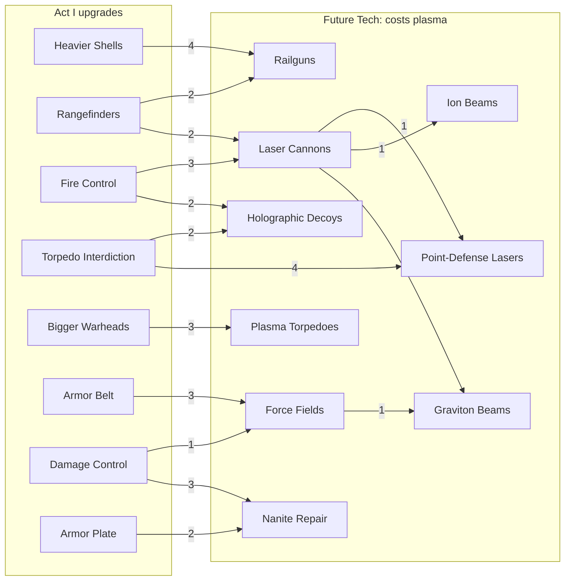

# Master of Oceans

A sea-based take on the tactical ship battles from **Master of Orion (1993)**.
Fleets of destroyers, cruisers, battleships and torpedo boats fight on a small
grid of open ocean dotted with islands. You always command the Blue fleet
against a computer-controlled Red fleet.

In the **campaign**, you build your fleet in a workshop by solving math
problems (algebra and geometry, from the Fleet Algebra and Broadside games).
Correct answers earn steel, powder, fuel and blueprints, which you spend on
upgrades, new ships and repairs before taking on ever stronger Red fleets.
Winning mission 10 opens **plasma**, which pays for future tech: laser
cannons, force fields and more, for Act III's battles against Red's own future
fleet. **Retrofits** take that tech further on your older ship classes: a second
battery of lasers, or a force field generator of their own. With **Math Boost**
on, battles have math in them too: as a big hit is about to land, a MATH BOOST
box comes up beside it, and a click on it opens a 7th-grade problem. A right
answer makes the hit 30% stronger (or Red's 30% weaker). A wrong one costs 15%.



*Mission 26, The Tempest. It's your battleship's turn: the blue squares are
where it can move, the red brackets are the ships it can hit, and hovering over
one shows the damage to expect. The side panel compares the two ships: yours
has both retrofits (16 lasers and a force field of 280).*

This is an early prototype.

## A look around

<table>
<tr>
<td width="50%" valign="top"><br>
<b>Math Station.</b> Solve problems to earn the currencies. Every wrong choice is a
particular mistake: the working says which, with the figure. (<a href="#the-workshop">The workshop</a>)</td>
<td width="50%" valign="top"><br>
<b>Future Tech.</b> Once mission 10 is won, plasma buys lasers, force fields and the rest,
each built on Act I upgrades. (<a href="#future-tech-and-the-tech-tree">Future Tech</a>)</td>
</tr>
<tr>
<td width="50%" valign="top"><br>
<b>Retrofits.</b> Give one of your older classes a Laser Battery or a Field Generator,
and see what it does to that class first. (<a href="#retrofits">Retrofits</a>)</td>
<td width="50%" valign="top"><br>
<b>Mission briefing.</b> Red's fleet and upgrades, the lesson from your last battle,
and the Math Boost switch. (<a href="#missions">Missions</a>)</td>
</tr>
<tr>
<td width="50%" valign="top"><br>
<b>Battle.</b> Torpedo salvos cross the map over a turn or two, and can be outrun or
shot down. (<a href="#battles">Battles</a>)</td>
<td width="50%" valign="top"><br>
<b>Math Boost.</b> A big hit freezes just before it lands, with a box beside the
ship about to be hit. (<a href="#math-boost">Math Boost</a>)</td>
</tr>
<tr>
<td width="50%" valign="top"><br>
<b>Boost problem.</b> A click on the box opens a 7th-grade problem: right makes the
hit 30% better, wrong 15% worse.</td>
<td width="50%" valign="top"><br>
<b>Debrief.</b> What cost you most and the upgrade that helps, and your hits against
the odds. (<a href="#the-debrief">The debrief</a>)</td>
</tr>
</table>

`python docs/screenshots.py` takes these again from the game itself. There is also a
22-second [promotional video](docs/promo.mp4), made the same way by `python docs/promo.py`
(it needs ffmpeg).

## Running it

You need **Python 3.10 or newer** ([python.org](https://www.python.org/downloads/)).
It runs locally on Windows, macOS and Linux in a normal desktop window.

### On Windows: double-click

Double-click **`Play Master of Oceans.bat`** in the game folder. The first
time, a window opens while it sets the game up (a minute or so, and it needs the
internet). It makes a private Python environment in `.venv`, installs pygame
into it and puts a **Master of Oceans** shortcut on the desktop. After that,
the shortcut or the `.bat` file starts the game straight away.

* It always plays the code in the folder, so after you `git pull` a new version
  the next launch plays it. If `requirements.txt` changed, it installs the new
  requirements first.
* If the game crashes, a message box says so and where it wrote the details
  (`crash.log`, next to the save files).
* If Windows says it protected your PC (this can happen with a downloaded ZIP),
  click **More info**, then **Run anyway**.
* If you already made `.venv` by following the steps below, it uses that one.

### From the command line

```bash
# one-time setup, from the project folder
python -m venv .venv
source .venv/bin/activate        # Windows: .venv\Scripts\activate
pip install -r requirements.txt

# play
python -m seabattle
```

On some systems the command is `python3` instead of `python`. On Windows, `py`
also works.

Other ways to start it:

```bash
python -m seabattle --scenario battle_line            # skip the menu, straight into a quick battle
python -m seabattle --headless --scenario skirmish    # no window: computer vs computer, print the battle log
python -m seabattle --headless --scenario battle_line --runs 200   # win rates, for balancing
python -m seabattle --list                            # list quick-battle scenarios
python -m seabattle.balance                           # campaign balance: a modeled player's win rates, mission by mission
```

## The campaign

Choose **Campaign** on the title screen, then a save slot. You start with
three picket boats and two torpedo boats.

### The workshop

**Math Station.** Answer multiple-choice problems (press 1-4 or click).
* **Fleet Algebra** (Algebra I) has five topics: Navigation · Linear,
  Intercept · Systems, Gunnery · Quadratics, Radar · Powers & Roots and, once
  mission 10 is won, Reactor · Exponentials (percent growth and decay, half-life,
  exponential models).
* **Broadside** (Geometry & Trig) has five more: Lookout · Angles,
  Plot · Triangles, Gunnery · Trig, Engineering · Area & Volume and, once
  mission 10 is won, Shields · Circles (circle equations, inscribed angles, tangents
  and chords).
* Switch topics on and off with the chips above the problem.
* **H** opens the briefing for the current kind of problem. Broadside problems
  come with the game's diagrams (compass bearings, triangles, shapes), and
  their equation stays hidden until you press **E**, as in the original.
  Gunnery · Trig problems have a **Trig table** (**T**): the 2-decimal values
  every answer is worked out from.
* Every wrong choice is a particular mistake, such as adding the two sides
  instead of using a² + b², or using cos where the side you want needs sin. Pick
  one and the working opens by itself, headed by what that mistake was. The right
  answer gets a ✓ and your pick a ✗. **W** shows the working after you answer.
* **Missed problems come back.** A kind of problem you get wrong returns two
  problems later with new numbers ("Review"), until you get one right.

Each topic pays out in one currency, and each currency can be earned with
either algebra or geometry:

| Currency | Buys | Earned from |
| --- | --- | --- |
| Steel | hulls and armor | Navigation · Linear, Engineering · Area & Volume |
| Powder | guns, warheads | Gunnery · Quadratics, Gunnery · Trig |
| Fuel | torpedoes, missiles, engines | Intercept · Systems, Plot · Triangles |
| Blueprints | electronics, new ship classes | Radar · Powers & Roots, Lookout · Angles |
| Plasma (once mission 10 is won) | future tech, the Plasma ship classes | Reactor · Exponentials, Shields · Circles |

**Difficulty** (a slider from 1 to 5, set separately for each game) controls
how often you get one-step, few-step and multi-step problems. Level 5 is all
multi-step, including all of Broadside's "missile" problems.

**Pay is tied to difficulty.** Every topic has the same base pay, so steel and
blueprints are as quick to earn as powder and fuel. A few-step problem pays
x1.75 that base and a multi-step problem pays x4, because it takes several
times as long. That works out to about x1 at level 1, x2.25 at level 3 and x4
at level 5. The streak bonus is a share of the problem's pay: +15% for each
right answer in a row, up to +75%. So a student who moves up a level earns
more per problem even though they get more wrong there.

**Wrong answers cost 35% of what the problem would have paid** (your balance
never goes below zero). With four choices, a blind guess is right one time in
four, so guessing works out to slightly less than nothing on average. Only
solving the problems pays.

**Logbook.** How each topic is going (overall and by one-step, few-step and
multi-step), the skills that need work and the ones going well (from your
last 10 answers to each kind of problem), how many kinds are waiting for
review, and your records.

**Upgrades** are fleet-wide and apply to every ship you own or build later.
Each level costs twice as much as the one before, so the top levels are
long-term goals:
* **Guns:** heavier shells, extra turrets, rangefinders, fire control.
* **Torpedoes:** bigger warheads, more tubes, faster torpedoes, longer range.
* **Hull:** engines, armor plate, armor belt.
* **Systems:** damage control (ships repair themselves during battle) and
  torpedo interdiction (shoots down incoming torpedoes and missiles).
* **Future Tech** (once mission 10 is won, paid for with plasma): see
  [Future Tech and the tech tree](#future-tech-and-the-tech-tree).

**Shipyard.** Build more ships. Destroyers, light cruisers, battleships and the
**missile cruiser** can be unlocked at any time, for a one-time blueprint cost.
In Act III, plasma unlocks three more (the **Plasma ships** button):

| Class | Unlocks | What it is for |
| --- | --- | --- |
| Hydrofoil Raider | winning mission 20 | A torpedo corvette at speed 5: the one ship fast enough to launch torpedoes on the first turn |
| Aegis Cruiser | winning mission 20 | Built with a force field and point-defense lasers that guard the ships next to it |
| Stormbreaker | winning mission 20 | Your own super ship: 16-inch guns behind a force field. At most two |

The Shipyard's third page, **Retrofits**, fits future tech to the Act I
classes: see [Retrofits](#retrofits).

**Fleet & Repairs.** Ships sunk in battle are not lost for good: they are towed
home as wrecks. Repairing one costs an eighth of the price of a new ship of
that class (a twelfth, then a sixteenth, with Nanite Repair). Each class sails as
one squadron and at most six can sail, so once you own more than six classes,
click **Sails / In port** to choose; otherwise the six with the most hull go.
This page also shows the next mission and your campaign progress, and lets you
replay missions you have won as skirmishes (see below).

### Future Tech and the tech tree

Plasma opens when you win mission 10, with its two math topics and the **Future Tech**
page of the Upgrades tab. Each future tech costs plasma plus the Act I
currency that matches it (lasers take powder, force fields take steel), and
each level costs twice the one before. Each one also builds on Act I upgrades,
which makes a tree. The number on each arrow is the level needed:



| Future tech | Levels | What it does | Beaten by |
| --- | --- | --- | --- |
| Laser Cannons | 3 | Fits lasers in every ship's free mount (1 on a corvette, 2 on a destroyer, 4 on a cruiser, 8 on a battleship, 12 on a dreadnought): 6 damage, +3 to hit, range 6, and they burn straight through armor belts. Levels 2 and 3: +2 laser damage | Force fields, decoys |
| Ion Beams | 2 | Laser hits drain force fields twice as fast, then three times | Ships without fields |
| Graviton Beams | 2 | Half, then all, of a laser's overkill carries into the next ship of the stack | A few big ships |
| Railguns | 2 | Level 1: guns halve armor belts. Level 2: +1 range for every gun | Force fields |
| Plasma Torpedoes | 2 | +6 torpedo damage per level, but a torpedo loses 1 damage for every tile it runs | Point defense, keeping your distance |
| Force Fields | 4 | A field of 10% of each ship's hull per level. It soaks up gun, laser and missile damage before the hull and refills at the start of the ship's turn. Torpedoes run under it | Ion beams, one big volley, torpedoes |
| Point-Defense Lasers | 2 | +10% interception per level. Level 2 also guards the stacks next to yours, at half the chance | Big salvos |
| Holographic Decoys | 3 | 10% per level of the shots, torpedoes and missiles aimed at your ships hit a hologram instead, however accurate | Swarms: most of their fire still lands |
| Nanite Repair | 2 | +5% of the hull repaired each turn per level, and wrecks cost a twelfth, then a sixteenth, of a new ship to repair | Focused fire |

Every class you can build uses at most three of its four weapon mounts, so
lasers take the free one; every other future tech improves what a ship already
carries. [Retrofits](#retrofits) take lasers and fields further on one class.
Force fields add a third kind of defense, beaten a different way from the
other two:

| Defense | What it stops | Best against | Beaten by |
| --- | --- | --- | --- |
| Armor belt | A fixed amount off every hit | Many small hits | Big guns, torpedoes, lasers |
| Force field | A pool of damage that refills every turn | Fire spread over several rounds | One big volley, ion beams, torpedoes |
| Damage control | Repairs after the damage | Long fights | Focused fire that sinks a ship in one turn |

Damage control, nanite repair and force field generators can't keep up with a
super ship's size: super ships never repair themselves in battle, and only
have the force field they were built with.

### Retrofits

Future Tech reaches every ship in the fleet: Laser Cannons put lasers in each
ship's free mount, and Force Fields give each ship a field of 10% of its hull
per level. The Plasma classes are built with more than that (the Aegis Cruiser
has a field of its own). **Retrofits** bring Act I's six classes up to the same
standard, one class at a time. They are on the **Retrofits** page of the
Shipyard, which opens with Plasma (before that it shows what's coming).

| Retrofit | Needs | What it does to the class |
| --- | --- | --- |
| Laser Battery | Laser Cannons 1 | Its lightest guns come out (the machine guns, or the Light Cruiser's 4-inch guns) and a second battery of lasers goes in: twice the lasers. They improve with Laser Cannons, Ion Beams and Graviton Beams like any other laser |
| Field Generator | Force Fields 1 | A force field generator of its own, like the Aegis Cruiser's: a field of 20% of the hull, on top of the fleet's Force Fields |

* A retrofit is bought **once for the whole class**: every ship of that class
  has it, the ones afloat, wrecks once they are repaired, and ships you build
  later. A class can have both.
* It costs plasma plus the Act I currency that matches (powder for lasers,
  steel for fields), more for bigger hulls:

  | Hull | Laser Battery | Field Generator |
  | --- | --- | --- |
  | Corvette (Picket Boat, Torpedo Boat) | 30 Plasma, 20 Powder | 30 Plasma, 25 Steel |
  | Destroyer | 60 Plasma, 40 Powder | 60 Plasma, 50 Steel |
  | Cruiser (Light Cruiser, Missile Cruiser) | 120 Plasma, 80 Powder | 120 Plasma, 100 Steel |
  | Battleship | 240 Plasma, 160 Powder | 240 Plasma, 200 Steel |

* Each retrofit on the page says what it would do to that class with your
  upgrades as they are, such as "Lasers 8 → 16 a ship, 6x Machine Gun out" or
  "Field 140 → 280 a ship". Hover over it for the price and what it needs.
* The class's name in the Shipyard shows the retrofits it has, and its stats
  include them.
* The Plasma classes are built with future tech, so they can't be retrofitted.

### Missions

**Set Sail** shows the mission briefing (the Red fleet and its upgrades) and
starts the battle. There are thirty missions in three acts of ten, then endless
patrols. They are balanced so that about 15 problems between missions keeps
your fleet in the fight, and about 30 before a super mission (see
[Balancing the campaign](#balancing-the-campaign)).

**Super missions.** Missions 10, 20 and 30 close each act, and winning one
opens the next:

| # | Super mission | Red's fleet | Winning it opens |
| --- | --- | --- | --- |
| 10 | Cruiser Squadron | 3 light cruisers, 6 destroyers, 6 picket boats | Act II, and Plasma: future tech, retrofits and two new math topics |
| 20 | The Kraken | the Kraken, a dreadnought and a Leviathan | Act III, and all three Plasma ship classes |
| 30 | The Maelstrom | the Maelstrom, 2 Leviathan Mk IIs and 6 destroyers, with Red's tech at its strongest | the endless patrols: the sea is yours |

* They are Red's biggest fleets yet, much harder than the missions around
  them (harder than the mission after, too), and longer battles. Spend extra
  time in the workshop first, and expect more than one try.
* They pay twice the prize money, and the dockyards repair half the ships a
  super mission sinks (rounded down, class by class) for free, win or lose.
  The rest come home as wrecks as usual, so a retry still needs math to pay
  for its repairs, but a lost super mission doesn't sink the campaign.
* With [Math Boost](#math-boost) on, more of their hits count as big, and up
  to 25 come up instead of 10.
* The briefing, the Fleet page and the result say "Super Mission", and the
  campaign list shows the ones still to come in orange.

* **Act I, missions 1-10**: from a pair of picket boats up to Red's cruiser
  squadron.
* **Act II, missions 11-20**: Red's missile cruisers and flagship, then from
  mission 13 its **super ships**. They are much bigger than anything you can
  build before Act III, and Red never sells them:

  | Super ship | Hull | Guns and missiles |
  | --- | --- | --- |
  | Dreadnought | over twice a battleship's | eight 16-inch guns |
  | Leviathan | over twice a battleship's | six missile launchers and 12-inch guns, as fast as your cruisers |
  | Kraken | five times a battleship's | twelve 16-inch guns and eight missile launchers, but slow |

  Most of these missions are one or two super ships, and from mission 15 on
  they come with a screen of Red's own cruisers, destroyers and boats, growing
  as the act goes on. Super mission 20 brings out all three at once.
* **Act III, missions 21-30**: after the Kraken, Red fields future tech of its
  own, one new technology a mission, and the debrief names its counter. Like
  Act II's, these missions pay plasma prize money as well.

  | # | Mission | Red's new tech | What it teaches |
  | --- | --- | --- | --- |
  | 21 | Salvage Rights | none | A familiar fight while your first future tech comes in |
  | 22 | Strange Lights | Laser Cannons | Lasers ignore your belts: decoys and fields help, or sink the laser ships first |
  | 23 | The Shimmer | Force Fields | Fields refill every turn: hit one ship with everything at once, or send torpedoes under |
  | 24 | Ghost Fleet | Holographic Decoys | Some shots hit holograms, whatever the odds |
  | 25 | Plasma Run | Plasma Torpedoes | Plasma fades as it runs: keep the boats at range and shoot them down |
  | 26 | The Tempest | Ion Beams, stronger fields | A laser super ship; ion beams drain your fields fast |
  | 27 | Rail Line | Railguns, Point-Defense Lasers | Railguns halve your belts, so fields do more of the defending |
  | 28 | Graviton Storm | Graviton Beams | Overkill runs through your stacks: big stacks of small boats suffer most |
  | 29 | The Gauntlet | stronger fields and decoys | Everything at once |
  | 30 | The Maelstrom | everything, at its strongest | The finale, a super mission: the Maelstrom, two Leviathan Mk IIs and six destroyers |

  Act III brings three new super ships:

  | Super ship | Hull | Weapons |
  | --- | --- | --- |
  | Tempest | over twice a battleship's | sixteen lasers, six 16-inch guns and eight 6-inch guns |
  | Leviathan Mk II | over twice a battleship's, with a force field | eight missile launchers, eight 12-inch and eight 6-inch guns |
  | Maelstrom | five times a battleship's, with a force field | twelve 16-inch guns, eight missile launchers, sixteen 6-inch guns and Red's lasers |
* **Patrols** follow: the Maelstrom with a growing escort of destroyers and light cruisers. The first
  brings 20% more escorts than a screen of ten destroyers and three light cruisers, and each one after
  brings 20% more than the last; the Maelstrom itself stays one ship.

Red's upgrades are part of each mission: every mission lists what Red has
gained so far, and Red never loses an upgrade. They depend only on how far the
campaign has got, never on your fleet, so every upgrade you buy puts you
further ahead. Red's Act I upgrades never go past level 2, so their top levels
are yours alone. Red's technology stops improving after mission 30. Super ships
never repair themselves in battle and keep only the force field they were
built with.

Saves from before Act III that were already on patrols pick up at mission 21.

* **Win:** sink every Red ship. Red never retreats from a mission, so it fights
  to the last ship. The campaign then moves on to the next mission and pays
  prize money.
* **Lose or withdraw** (the **W** key, pressed twice, pulls your whole fleet
  out): nothing is lost for good. The dockyards repair half the ships the
  battle sank (rounded down, class by class) for free, as they do after a
  super mission, so one defeat doesn't leave your fleet too weak for the retry.
  The rest come home as wrecks: repair, upgrade and try again. The map is
  different each time.
* **Red's dockyards are no faster than yours.** Of the Red ships a lost battle
  sinks, half (rounded down, squadron by squadron) stay sunk for your next try
  at that mission, so every try wears Red down. The briefing and the Fleet page
  show how many are still sunk. Winning the mission ends it; skirmishes always
  bring Red's full fleet.

### Math Boost

The mission briefing has a **Math Boost** switch (**B**, or click it). With it
on, the battle freezes just as a big hit is about to land: the shells hang in
the air, or the torpedoes sit at the ship. Gold brackets mark the ship about
to be hit, and a **MATH BOOST** box comes up beside it, saying whether a right
answer makes the hit stronger (yours) or weaker (Red's). The log says what is
about to happen ("Red Battleship x1 is about to fire 12" Guns at your
Destroyer x5: 30 damage, 1 sunk.").

* **Click the box** (or press **B**) to take the boost: a 7th-grade problem
  opens.
* **Leave it**, and after 5 seconds the hit lands as it was rolled (the bar
  along the bottom of the box counts down, and stops while the mouse is on
  the box). **Space** lets it land straight away. Nothing is lost by passing.

Once you take it, your answer decides the hit:

* **Your big hit:** answer right and it does 30% more damage; answer wrong and
  it does 15% less.
* **A big hit on your ships:** answer right and they take 30% less; answer
  wrong and they take 15% more.
* After a wrong answer the problem also shows what the mistake was and the
  worked steps.

Each problem gets one try; **H** shows a hint first. Right answers carry on by
themselves; after a wrong one, **Enter** carries on. Either way the frozen hit
then lands with its new damage, and "BOOST +30%" (or the cost) shows over the
ship.

**Why wrong answers cost something.** With four choices a blind guess is right
one time in four. If wrong answers cost nothing, guessing would still pay. With
the 15% penalty, a player who guesses every answer comes out slightly behind
one who doesn't answer at all: about 1 damage lost per boost in simulated
battles, and in the campaign about the same results as with Math Boost off.
A player who gets 80% right keeps nearly all of the benefit (about 8 damage
gained per boost, against 9.5 with no penalty). So, as in the workshop, only
solving the problems pays. The two numbers are `BOOST` and `PENALTY` in
`seabattle/boost.py`.

**What counts as a big hit.** Battles differ a lot, so "big" is measured
against the battle itself. A hit is big when its hull damage is

* at least 5% of the smaller fleet's hull at the start of the battle, and
* at least as big as the middle one of all the hits so far in the battle, both
  sides' (the first three hits only need the 5%).

On top of that there is at most one boost per ship's turn (and one when
torpedoes and missiles arrive at the start of a round), and at most 10 a
battle, counting the ones you pass. For the modeled player (see [Balancing the campaign](#balancing-the-campaign))
that comes to 5-10 boosts in 80% of battles from mission 5 on, about 6 on
average, split about evenly between your hits and Red's. Missions 1-4 are two
to four rounds with a handful of hits, so they get 2-4.

**Super missions** (10, 20 and 30) have more math in them: a hit is big from
2.5% of the smaller fleet's hull, if it is at least as big as the hit a
quarter of the way up the hits so far (instead of the middle one), and up to
25 come up instead of 10. The modeled player gets about 8 in mission 10, a
short battle, about 22 in the Kraken and about 12 in the Maelstrom
(`SUPER_FLOOR`, `SUPER_BAR` and `MAX_PER_SUPER_MISSION` in `seabattle/boost.py`).

**Turning it off.** The **Turn off** button by "MATH BOOST ON" in the side
panel (click it twice), or the problem's **Turn off Math Boost for this
mission** button, switches it off for the rest of that battle. The briefing's switch decides the next one, and it is
saved with the campaign (new campaigns start with it off). Skirmishes use it
too. The side panel keeps the score during the battle, the result screen sums
it up ("Math Boost: 6 of 8 right, +54 damage dealt, 31 damage stopped, 7 lost
to wrong answers.") and the Logbook keeps the tally.

**The problems** come from the **Dino Math: Realistic** game, ported line by
line: 15 topics, wrong choices from common mistakes with the reason each is
wrong, a hint and the worked steps, geometry sketches drawn to scale, and
number lines to choose from for graphing inequalities. The wrong choices are
picked the way the workshop's are, so the answer can't be found from where it
sits among them (in the original it was rarely the largest choice): where a
problem's mistakes all fall on one side of the answer, a near miss on the
other side takes a place. A topic never comes up twice in a row. Dino Math has five levels: each adds topics, and harder kinds
of problem and bigger numbers open inside the topics as the level rises.
Math Boost has no level setting: each problem's level is drawn afresh, mostly
the middle one (`LEVEL_ODDS` in `seabattle/boost.py`), and the problem shows
its topic and level:

| Level | Comes up | Adds |
| --- | --- | --- |
| 1 | 10% | Integers, one-step equations, proportions, percents |
| 2 | 20% | Two-step equations, fractions, decimals, angles |
| 3 | 40% | Percent change, expressions, inequalities |
| 4 | 20% | Probability, circles & area, statistics |
| 5 | 10% | Surface area & volume |

The missions are balanced without Math Boost, so it makes them easier. The
big hits carry about half of a battle's damage, so the boosts count, most of
all in the super missions: with 80% of its boost problems right, the modeled
player wins super missions 10 and 20 at the first try about 72% of the time
instead of 20-55%, and needs about 22 workshop problems per mission won
instead of 24 (`python -m seabattle.balance --boost 0.8`). The Maelstrom
stays hard, about a quarter either way. Guessing every answer (`--boost 0.25`)
gives 25 problems per mission won, the same as with Math Boost off within the
model's noise.

### The debrief

After every battle the side panel shows a debrief:
* **What to take from it:** up to three lessons, the costliest first. They
  cover:
  * armor belts soaking up your gun damage;
  * damage wasted on ships that were already sinking;
  * torpedoes that ran out of range, lost their target or were shot down;
  * which of Red's weapons did most of the damage;
  * Red ships repairing themselves;
  * force fields soaking up your fire, shots lost to holograms, and graviton
    beams carrying damage through your stacks.

  In the campaign they name the upgrade that helps. The lessons come back on
  the next mission briefing.
* **Hits against the odds:** for each of your weapons, how many hits you scored,
  how many the odds predicted, and the range that number usually lands in, so
  you can see whether you were lucky or not.

### Skirmishes

On the **Fleet & Repairs** page, click any mission you have already won to
replay it as a skirmish: a practice battle against that mission's Red fleet and
upgrades, on a new map each time. A win pays a tenth of the mission's prize
money (from 7 currency for mission 1 up to 129 for the Maelstrom), so solving
problems stays the way to earn. Ships sunk in a skirmish come home repaired for
free, and the campaign stays where it is, so skirmishes are a safe place to try
out tactics or a new fleet.

### Save files

The campaign saves itself after every answer, purchase and battle. Save files
are plain JSON, one per slot (`campaign1.json` to `campaign3.json`), in your
own data folder rather than the game folder, so a new version of the game or a
deleted game folder doesn't take them with it:

| System | Save folder |
| --- | --- |
| Windows | `%APPDATA%\Master of Oceans\saves` |
| macOS | `~/Library/Application Support/Master of Oceans/saves` |
| Linux | `~/.local/share/master-of-oceans/saves` (or under `$XDG_DATA_HOME`) |

The save-slot screen shows the folder too. `settings.json` there remembers
whether the sound is on. Copy the files to back up or move a campaign. Set the
`SEABATTLE_SAVE_DIR` environment variable to keep them somewhere else.

* Each save is written in full before it replaces the last one, so a crash or
  a power cut can't leave half a save. The save before it is kept as
  `campaign1.bak` (and so on).
* If a save file is ever damaged, it is renamed `campaign1.damaged-<date>.json`
  (never deleted) and the campaign comes back from the `.bak` file, one save
  earlier. With no good backup, the slot says so and is free for a new campaign.
* A save the game can't read just now (another program has it open) or one made
  by a newer version of the game is never overwritten: the slot says what's
  wrong and offers to try again.
* If a save can't be written (a full disk, say), the game says so and carries on.
* Earlier versions kept saves in a `saves` folder inside the game folder. The
  game moves them to the new folder the first time it starts and leaves a note
  in the old folder saying where they went.

## Battles

Each side has up to six **stacks**. A stack is a group of identical ships that
moves and fires together. Each round, every stack acts once, fastest first. On
your stack's turn you can move up to its speed and fire each weapon group once,
in any order.

* **Click a highlighted tile** to move there.
* **Click an enemy in red brackets** to fire every ready weapon that can reach it.
* **Hover over any ship** to see its stats. Hovering over an enemy on your turn
  also shows your hit chance and expected damage.
* Press **H** in battle for the full list of keys.

| Key | Action |
| --- | --- |
| Space / Enter | End this stack's turn |
| 1-4 or click a weapon line | Hold or release a weapon group, e.g. to save torpedoes |
| A | Let the computer play this stack for this turn |
| Z | Let the computer play your whole fleet (toggle) |
| R (twice) | Retreat this stack from the battle |
| W (twice) | Campaign: withdraw the whole fleet |
| F | Faster animations |
| P | Pause |
| M | Sound on / off (anywhere in the game) |
| Esc | Quick battle: back to the menu. Campaign: withdraw |
| B / Space | Campaign with Math Boost on, when a MATH BOOST box is up: take it / let the hit land |

**Quick Battle** on the title screen skips the campaign and plays one of four
preset scenarios.

### Rules, and how they map to Master of Orion

| Master of Orion | Here | What it does |
| --- | --- | --- |
| Beam weapons | Guns | Hit instantly, within their range |
| Missiles | Torpedoes | Cross the map over one or more turns, home in on the target, can be outrun, and only a couple of salvos per ship |
| Missiles | Missiles (missile cruiser) | Faster and longer-ranged than torpedoes, but reduced by armor belts |
| Battle computer | Fire control | +1 attack level per point |
| Beam defense | Evasion | Small, fast hulls are harder to hit |
| Shields | Armor belt | Subtracts from every gun and missile hit. Torpedoes strike below the belt and ignore it |
| Armor | Hull plating | Multiplies hit points |
| ECM | Countermeasures | Adds to evasion against torpedoes and missiles |
| Anti-missile rockets | Torpedo interdiction | Chance to shoot down each incoming torpedo or missile |
| Automated repair | Damage control | Repairs part of a damaged ship's hull at the start of each of its turns |
| Engines | Propulsion | Combat speed (and evasion for the best engine) |
| Laser (beam weapon) | Laser cannons | Accurate, and they burn through armor belts |
| Graviton beam (damage streams on) | Graviton beams | Laser overkill carries into the next ship of the stack |
| Neutron pellet gun (halves shields) | Railguns | Guns halve armor belts |
| Displacement device | Holographic decoys | Some shots miss, however accurate |

Force fields are this game's own: MOO1's shields are already the armor belt.

* Hit chance = 50% + 10% × (attack − defense), limited to 5–95%.
* Damage goes to the top ship of a stack. Damage beyond what sinks that ship is
  wasted (unless Graviton Beams carry it on), so many light guns are good
  against swarms of small boats and a few heavy guns are good against big ships.
* Each hit goes through the same steps: holographic decoys may draw it off,
  then it has to hit; the armor belt takes its share (lasers and torpedoes
  ignore it, railguns halve it); a force field soaks up what it can (torpedoes
  run under it); the rest comes off the hull.
* The map is 14 × 9 tiles, and the fleets start 11 tiles apart. That is just
  beyond one move plus a torpedo's or laser's range, so nobody can launch
  torpedoes or fire lasers on the first turn unless the **Engines** upgrade
  makes their ships faster, or they are Hydrofoil Raiders. Red never gets
  either.
* The battle ends when one side has no ships left on the map (sunk or
  retreated), or in a draw after 40 rounds.

## Project layout

```
Play Master of Oceans.bat   the Windows launcher (see Running it)
seabattle/
  components.py  hulls, weapons and ship systems (plain data)
  design.py      ShipDesign: hull + systems + up to 4 weapon mounts, plus refit bonuses
  designs.py     the preset ship designs, up to the missile cruiser, and Red's super ships
  battle.py      the battle rules. No graphics; actions in, events out
  ai.py          the computer opponent
  economy.py     currencies (plasma too), upgrade tracks and the Future Tech tree, refit(), the shipyard catalog,
                 and the retrofits (retrofit() fits them to a class's design, before refit())
  campaign.py    campaign state, missions (Acts I, II and III), battle results, reviews, save files
  debrief.py     the after-action debrief: lessons, and hits against the odds
  problems/      the math problems: fleet_algebra.py and broadside.py (ported
                 from the two games), difficulty levels, pay and penalties, and
                 dinomath.py, Math Boost's 7th-grade problems (from Dino Math: Realistic)
  scenarios.py   quick-battle scenarios and random islands
  headless.py    run AI vs AI battles without a window
  balance.py     the modeled player that balances the campaign (python -m seabattle.balance)
  boost.py       Math Boost: which hits are big, the boosts and the score (no pygame)
  ui/            the pygame front end (title, save slots, workshop, battle) and
                 sound.py, sound effects synthesised in code (no audio files)
  assets/fonts/  DejaVu Sans, for math symbols (see LICENSE-DejaVu.txt)
  assets/icon.*  the game's icon, for the window and the desktop shortcut
docs/            the README's screenshots, and screenshots.py, which takes them from the game
                 (python docs/screenshots.py; it uses its own save folder); promo.mp4, a
                 22-second video, and promo.py, which records it the same way
tests/           rules, AI, campaign, balance, problems, debrief, sound and UI smoke tests
                 (pytest). test_problem_guessing.py checks that no blind trick
                 (the middle value, the odd one out...) finds the answer, in the
                 workshop or in Math Boost; test_dinomath.py that the port writes
                 the same problems as the original engine (dinomath_original.json
                 holds its fingerprints); test_problem_keys.py that saved progress
                 survives a generator being renamed (generator_keys.txt)
```

The rules engine (`battle.py`) knows nothing about graphics. The UI and the AI
both drive it the same way: they pass actions (`Move`, `Fire`, `Retreat`,
`Withdraw`, `EndTurn`) to `Battle.apply()` and get back a list of events
describing what happened. The UI animates those events and the headless runner
prints them. `Battle.preview()` works an action out on a copy of the battle
without changing it, which is how Math Boost spots a big hit before it lands
(the battle screen plays the preview up to the hit and freezes it there), and
`apply()` can scale the damage of chosen hits. The campaign and the problems are plain Python too, so all of it
is covered by tests without opening a window.

## Balancing the campaign

`python -m seabattle.balance` plays the whole campaign with a modeled player
and prints, for each mission, how often it wins at the first try, how many
tries it takes and how much of its fleet's hull a first-try battle sinks. The modeled player stands in for a student:

* between missions it solves 15 problems at difficulty 2 and gets 80% right,
  earning whichever currency its next repair or purchase is short of. Before
  a super mission, and before each retry of one, it solves 30;
* it repairs every wreck first, then spends on whatever most improves its fleet
  against the coming mission and the three after it, per unit of currency
  (upgrades, ships and retrofits alike);
* it fights the way the **Z** key plays your fleet, against Red's campaign AI;
* a lost mission is tried again after another 15 problems (30 for a super mission).

The missions are tuned to these targets: about 85% first-try wins or better for
most missions and about 75% for the set pieces (the Dreadnought, Twin
Dreadnoughts, the Tempest, the Gauntlet). The [super missions](#missions) aim
much lower, at about 40% first-try wins and two or three tries in all, the
Maelstrom a little harder. With Math Boost on they come in much higher, since
that's where most of the boosts are. Four seeds (16 players each, Math Boost off) give:

| Super mission | First try | Tries |
| --- | --- | --- |
| 10, Cruiser Squadron | 23-48% | 1.6-2.0 |
| 20, The Kraken | 15-35% | 3.0-3.4 |
| 30, The Maelstrom | 11-16% | 3.5-4.3 |

The other missions come in at 78-100% first try, Act III's included: its fleets
are sized for a player who has beaten the Kraken, so each one costs a third to
a half of the fleet's hull. Two rules keep a lost mission from becoming a wall:
the dockyards repair half the ships a lost battle sinks, and half the Red ships
it sinks stay sunk for the next try. Without them, a player who lost once often
came back weaker and lost again (`tools/north_star.py` scores all of this
against the goals in `NORTH_STAR.md`). To tune a new or changed mission, try Red
fleets against the players who get there:

```bash
python -m seabattle.balance --mission 13 --fleet dreadnought:1 --fleet dreadnought:1,destroyer:2
```

then put the hardest fleet that still meets its target in `campaign.py` and run
the whole campaign again, since every mission changes the fleets the player
brings to the next. `--problems`, `--accuracy` and `--difficulty` change the
player, and `--seed` gives other players and maps. The model is a guide, not a
real player: it plays some fights worse than a person would, and with the
default 16 players a mission's numbers can move by 10-20% from one seed to
another, more near the end of the campaign. Try a couple of seeds before
trusting a number. The whole campaign takes about three minutes on four cores.

`--boost 0.8` fights with [Math Boost](#math-boost) on, taking every boost
and answering 80% of its problems right, and adds a column with how many boosts came up in each
mission's first-try battles.

## How the computer opponent thinks

`SimpleAI` is a small "utility" AI. At the start of each stack's turn it scores
every tile that stack could reach:

* **offense**: enemy firepower it expects to knock out by firing from that
  tile. This is expected damage weighted toward targets that are dangerous and
  low on hit points, which gives focus fire.
* **follow-up**: what it could hit next turn from that tile.
* **danger**: its own firepower it expects to lose next turn if it ends there.
  Each enemy's fire is split across all the stacks that enemy can reach.
* a small pull toward the enemy, so fleets don't wait around forever.

It also considers firing from where it is and then moving away (hit and
withdraw). It holds torpedoes and missiles for targets they are likely to hit
and not wildly overkill, allows for interception, doesn't double up on a
target that torpedoes are already heading for, and retreats when its fleet is
hopelessly outmatched (except in campaign missions, where Red fights to the
last ship).

## Roadmap ideas

1. **Ship designer screen.** The data model is already there:
   `ShipDesign.validate()` checks space, and the costs are computed.
2. **Harbors and shore batteries.** The equivalent of MOO1's planets and missile bases.
3. **Special systems.** Submarines and depth charges, mines, smoke screens.
4. **Smarter AI.** Difficulty levels, coordinated fleet tactics.
5. **Packaging.** A double-clickable app using PyInstaller.

## Tests

```bash
pip install pytest ruff
python -m pytest     # about four minutes
ruff check .         # looks for bugs (unused names, undefined ones...), not layout
```

GitHub Actions runs both on every pull request and push to `main`, on Linux
with the oldest and newest Python the game supports and on Windows
(`.github/workflows/tests.yml`). `tests/test_readme.py` checks that the rule
numbers in this README (Math Boost's 30% and 15%, the pay multipliers...) match
the code, so change both together.

## Credits

The math problems are adapted from the Fleet Algebra and Broadside games at
mstone.me, and Math Boost's from the Dino Math: Realistic game (muds42/website). Math text uses the DejaVu Sans font (Bitstream Vera license, see
`seabattle/assets/fonts/LICENSE-DejaVu.txt`).
